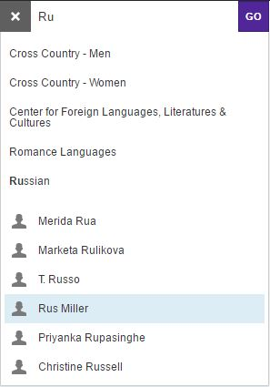

# wp-navbox
Developed for Williams College but easily modified for other clients. Features native WP search and navigation with text hinting, incorporating two different data streams with pre-determined text tokens (e.g. 'running' for 'cross-country') provided by JSON. In the case of the example shown, these consist of one list of college departments and another of faculty and staff contacts. 

[See the Navbox in the wild.] (http://math.williams.edu/)

##Inactive Navbox##

##Active Navbox##

